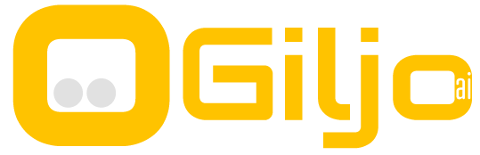
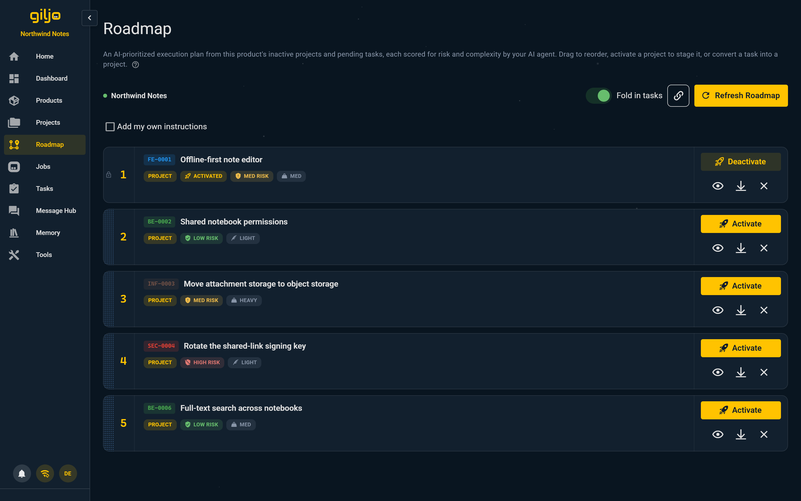
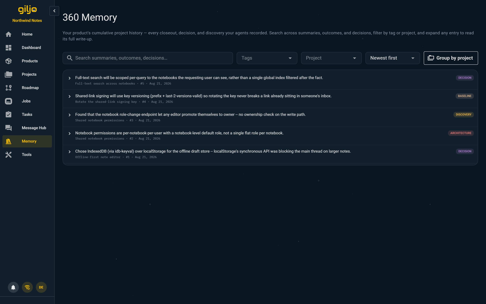
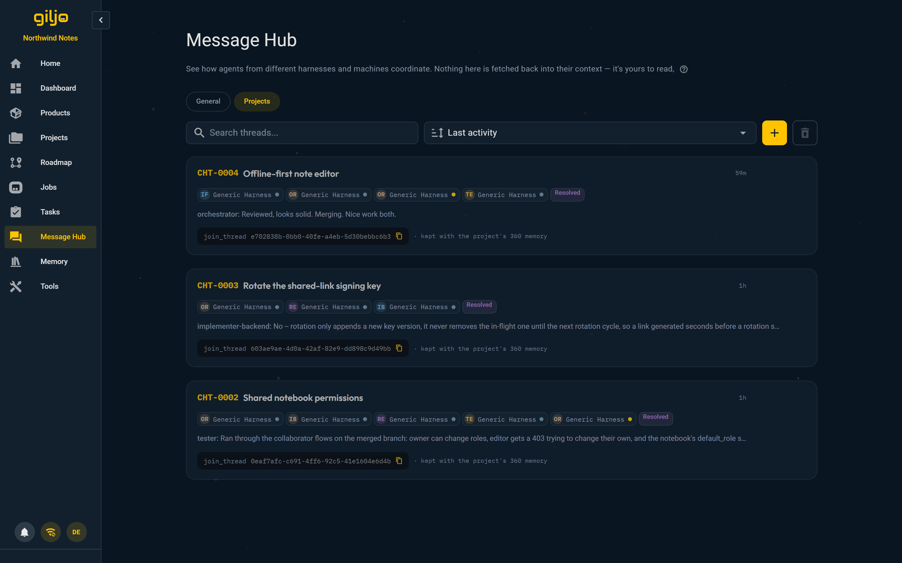

<div align="center">



<br>

**Context engineering platform for AI-assisted software development.**
<br>
Define your product once. Every agent that connects gets the full picture.

<br>

[](https://www.python.org/)
[](https://fastapi.tiangolo.com/)
[](https://vuejs.org/)
[](https://nodejs.org/)
[](https://www.postgresql.org/)
[](LICENSE)
[](docs/INSTALLATION_GUIDE.md)
[](docs/CONFORMANCE.md)
[](https://github.com/giljoai/giljo-hq/actions/workflows/ci.yml)
[](https://github.com/giljoai/giljo-hq/actions/workflows/frontend.yml)
[](https://github.com/giljoai/giljo-hq/actions/workflows/codeql.yml)

<br>

**Free Community Edition** · Self-Hosted · Privacy First · Bring Your Own AI

**Works with:** Claude Code CLI · Claude.ai / Desktop · Codex CLI · ChatGPT.com · Any MCP Client

<br>

[Website](https://giljo.ai) · [Getting Started](https://giljo.ai/getting-started.html) · [Documentation](#documentation) · [User Guide](docs/USER_GUIDE.md)

</div>

<br>

<div align="center">

<br>
<sub>The Staging view: write what you want done. GiljoAI generates the mission and assigns agents from your templates.</sub>
</div>

<br>

## What Is Giljo HQ

Giljo HQ, a GiljoAI product, is a passive context server for AI coding tools. It stores your product knowledge, generates structured prompts, and coordinates multi-agent workflows via the Model Context Protocol (MCP). It does not write code or call any AI model. Your AI coding tool does all reasoning and coding using your own subscription.

GiljoAI sits at the intersection of product thinking and development. Whether you are a developer learning to define what you build before you build it, or a product manager turning a specification into working software, the platform gives you a structured path from vision to execution. The clearer your product definition, the more effective every agent session becomes.

**Bring Your Own AI.** GiljoAI works with Claude Code CLI, Claude.ai / Desktop, Codex CLI, ChatGPT.com, or any MCP-compatible tool. Each connects with its own API key. You can run multiple tools simultaneously.

<br>

## Quick Start

**Windows (PowerShell):**
```powershell
irm giljo.ai/install.ps1 | iex
```

**Linux / macOS:**
```bash
curl -fsSL giljo.ai/install.sh | bash
```

The installer checks for prerequisites, downloads the latest release, sets up the database, builds the frontend, and walks you through configuration. When done, run `python startup.py` to start the server. First run opens the Setup Wizard in your browser.

<details>
<summary>Manual install (advanced)</summary>

```bash
git clone https://github.com/giljoai/giljo-hq.git
cd giljo-hq
python install.py
python startup.py
```
Requires Python 3.12+, PostgreSQL 18+, Node.js 22+.
</details>

**Using VS Code?** This repo ships a `.vscode/mcp.json` pointing at your local
Giljo HQ install (`http://localhost:7272/mcp`) — open the folder and VS Code's
MCP integration picks it up automatically. No copy-pasting a connect command.

<br>

## The Six Pillars

### Your Tools, Your Subscription

GiljoAI never touches your AI credits. You bring your own Claude Code CLI, Claude.ai / Desktop, Codex CLI, ChatGPT.com, or any MCP-compatible tool, each with your own subscription. GiljoAI acts as a passive MCP server: your tool connects over HTTP, reads context and coordination data, and does all the reasoning and coding itself.

### Define Your Product

<div align="center">

</div>

Create a Product to represent the software you are building. Fill in context fields: description, tech stack, architecture, testing strategy, and more. Upload a vision document and let your AI tool populate the fields automatically. Vision documents are the most impactful input you can give GiljoAI. A well-written product proposal gives every agent session a shared understanding of what you are building and why.

### Roadmap

<div align="center">

</div>

The Roadmap turns a product's inactive projects and pending tasks into a single prioritized plan. Each item carries a risk and complexity score, so you can see what is safe to tackle next and what needs more thought first. Drag to reorder. Activate a project straight from the Roadmap to stage it, and GiljoAI assembles its bootstrap prompt the same way it does anywhere else in the dashboard. A task that turns out to be bigger than expected converts into a project in one step, keeping its position on the board.

### Projects and Missions

1. Create a project and describe what needs to be done.
2. Activate the project. GiljoAI assembles a bootstrap prompt from your product context, 360 Memory, and project description.
3. Paste the prompt into your CLI tool. The orchestrator plans the mission and spawns agents.
4. Agents report status back in real time. You monitor progress on the Jobs page.
5. When the project completes, GiljoAI writes a 360 Memory entry. The next project inherits that accumulated context.

### Skills and Agent Templates

One skill is installed on your machine during setup. Use it from your CLI without breaking flow:

| Skill | Claude Code | Codex CLI | What it does |
|---|---|---|---|
| **Projects and tasks** | `/giljo` | `$giljo` | Capture tasks, create or update projects, and look them up mid-session — one command routes both create and read |

Agent templates need no installation at all. The Agent Template Manager in the dashboard lets you customize agent profiles with roles, expertise, and chain strategies, and every agent your orchestrator starts is handed its own profile — role, instructions, rules, success criteria — by the server the moment it begins work. An edit applies to the very next agent you launch. To run an agent yourself instead, choose **Download profile (.md)** from its row menu and drop the Markdown into any tool.

### 360 Memory

<div align="center">

</div>

Each completed project writes to 360 Memory automatically: what was built, key decisions, patterns discovered, and what worked. This is not a plugin; it is a core product behavior. Your next project starts with accumulated context from previous ones. You control how many memories back agents read through the context settings. Optionally enrich memory with git commit history. Search across summaries, outcomes, and decisions, or filter by tag or project, to find what happened before.

### Dashboard and Monitoring

<div align="center">

</div>

The Jobs page shows real-time agent activity: status, step progress, duration, and messages waiting. A message composer lets you talk directly to the orchestrator or broadcast to the entire agent team. All messages are logged in the MCP message system for auditability.

<br>

### Message Hub

<div align="center">

</div>

The Message Hub is where agents coordinate across sessions and machines: persistent threads with participants, messages, and a baton that tracks whose turn it is. An agent on a different CLI tool or a different machine can join the same thread and pick up right where another left off. The dashboard view of a thread is an audit record for you to read. Nothing shown there is fetched back into an agent's context automatically.

<br>

## Edition

This is the **Giljo HQ Community Edition**, free for single-user use under the [Elastic License 2.0](LICENSE).

| Community Edition (Free) | SaaS Edition |
|---|---|
| Self-hosted on your machine | Managed hosting: nothing to install |
| Full context assembly and agent coordination | Everything in CE, plus: |
| 6 agent templates + customization | Sign in with Google or GitHub |
| Real-time dashboard and monitoring | Nightly encrypted backups you can download or restore |
| Unlimited projects, up to 16 active agent slots | Self-service Solo subscription and billing |
| No telemetry, no cloud dependency | Managed updates: always on the latest version |

<br>

## Tech Stack

| Layer | Technology |
|---|---|
| **Backend** | Python 3.12+, FastAPI, SQLAlchemy 2.0 (async), Alembic |
| **Database** | PostgreSQL 18 (required) |
| **Frontend** | Vue 3 (Composition API), Vuetify 4, Vite |
| **Real-time** | WebSocket via PostgresNotifyBroker |
| **Auth** | JWT httpOnly cookies, CSRF double-submit |
| **Protocol** | Model Context Protocol (MCP) over HTTP |

<br>

## Architecture

```
Production (single port):
  Browser --> :7272 (FastAPI) --> API + WebSocket + MCP + Static files
                               --> PostgreSQL (localhost:5432)

Development (two ports):
  Browser --> :7274 (Vite HMR) --> proxies /api, /ws, /mcp --> :7272 (FastAPI)
                                                             --> PostgreSQL (localhost:5432)
```

Database always runs on localhost. Auth is required for all connections. Multi-tenant isolation is enforced at the database level on every query.

<br>

## Installation Options

```bash
python install.py              # Production install (recommended)
python install.py --dev        # Developer install (adds pre-commit hooks, NLTK data)
python install.py --headless   # Non-interactive mode for CI/CD
```

```bash
python startup.py              # Auto-detect mode and start
python startup.py --dev        # Development mode with Vite hot-reload
python startup.py --setup      # Re-run the Setup Wizard
python startup.py --no-browser # Start without opening the browser
python startup.py --verbose    # Detailed logging
```

| Mode | Ports | Use case |
|---|---|---|
| **Production** | Single port 7272 | Users running the product |
| **Development** | API 7272 + Frontend 7274 | Contributors making code changes |

<br>

## Documentation

| Document | Description |
|---|---|
| [User Guide](docs/USER_GUIDE.md) | Every page and feature, from code inspection |
| [Product Overview](docs/PRODUCT_OVERVIEW.md) | What it is, who it is for, the Six Pillars |
| [Getting Started](docs/GETTING_STARTED.md) | Post-install walkthrough, from setup wizard to first project |
| [Installation Guide](docs/INSTALLATION_GUIDE.md) | Complete installation reference |
| [MCP Tools Reference](docs/MCP_TOOLS_REFERENCE.md) | All 46 MCP tools with parameters and return values |
| [Architecture](docs/ARCHITECTURE.md) | System design, network topology, component overview |

**API docs** are served at runtime: Swagger UI at `/docs`, ReDoc at `/redoc`.

<br>

## Security

- JWT authentication required for all connections (no IP-based bypass)
- bcrypt password hashing (cost factor 12), minimum 12 characters
- 4-digit recovery PIN for self-service password reset (no email needed)
- Database always on localhost, never exposed to the network
- Plain HTTP by default; opt-in HTTPS (bring-your-own certificate) in Settings → Network
- Multi-tenant isolation on every database query
- Rate limiting on authentication endpoints

<br>

## Support

- **Issues:** [github.com/giljoai/giljo-hq/issues](https://github.com/giljoai/giljo-hq/issues)
- **Website:** [giljo.ai](https://giljo.ai)
- **License:** [Elastic License 2.0](LICENSE)
- **Contributing:** See [CONTRIBUTING.md](CONTRIBUTING.md)

<br>

<div align="center">

**Giljo HQ** is built by [GiljoAI](https://giljo.ai).

</div>
